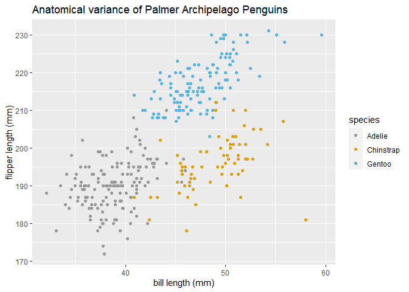

hw1\_p8105
================
Brandon Rojas
9/29/2021

## Problem 1

-   Create a data frame comprised of:
    -   a random sample of size 10 from a standard Normal distribution
    -   a logical vector indicating whether elements of the sample are
        greater than 0
    -   a character vector of length 10
    -   a factor vector of length 10, with 3 different factor “levels”

When taking the mean of each column in the dataframe, we notice that
norm\_samp, and “norm\_samp\_pos” return numeric values, as these
logical values are treated as 1/0, and norm\_samp is a series of numeric
values.

factor\_vector and char\_vec are not numeric or logical, and are factors
and character vectors. Characters cannot be added or divided, thus it
returns “NA”, the same goes for factors.

We can coerce these into being numeric as follows:

as.numeric(r\_samp\_tbl\[\[“norm\_samp\_pos”\]\])

as.numeric(r\_samp\_tbl\[\[“char\_vec”\]\])

as.numeric(r\_samp\_tbl\[\[“factor\_vector”\]\])

This will convert the logical into true numerical values 0 & 1, the
characters become NAs as they have no valid conversion, and the factor
vectors are receive values 1 to 3 because 3 levels of factor, “high,
medium and low” exist. Noted that coercing the factors into numeric
would allow you to take the mean.

``` r
set.seed(1337)

r_samp_tbl = tibble(
  norm_samp = rnorm(10),                       # random sample size 10, std normal~
  factor_vector = (factor(c("high", "medium", "low", "high", "medium", "low", "high", "medium", "low", "high"))),
  norm_samp_pos = norm_samp > 0,                                 # elements greater than zero
  char_vec = character(10),                                      #char vec of length 10
)

r_samp_tbl
```

    ## # A tibble: 10 x 4
    ##    norm_samp factor_vector norm_samp_pos char_vec
    ##        <dbl> <fct>         <lgl>         <chr>   
    ##  1     0.192 high          TRUE          ""      
    ##  2    -1.45  medium        FALSE         ""      
    ##  3    -0.323 low           FALSE         ""      
    ##  4     1.62  high          TRUE          ""      
    ##  5    -0.689 medium        FALSE         ""      
    ##  6     2.04  low           TRUE          ""      
    ##  7     0.944 high          TRUE          ""      
    ##  8     2.08  medium        TRUE          ""      
    ##  9     1.92  low           TRUE          ""      
    ## 10    -0.415 high          FALSE         ""

## Taking Means

``` r
##Means
mean(r_samp_tbl[["norm_samp"]])
```

    ## [1] 0.5926015

``` r
mean(r_samp_tbl[["factor_vector"]])
```

    ## Warning in mean.default(r_samp_tbl[["factor_vector"]]): argument is not numeric
    ## or logical: returning NA

    ## [1] NA

``` r
mean(r_samp_tbl[["norm_samp_pos"]])
```

    ## [1] 0.6

``` r
mean(r_samp_tbl[["char_vec"]])
```

    ## Warning in mean.default(r_samp_tbl[["char_vec"]]): argument is not numeric or
    ## logical: returning NA

    ## [1] NA

## Problem 2

``` r
data("penguins", package = "palmerpenguins")
```

The Palmer Penguin data, including mean flipper length, and the
observation types with the number of recorded values can be summarized
as follows:

``` r
summary(penguins)
```

    ##       species          island    bill_length_mm  bill_depth_mm  
    ##  Adelie   :152   Biscoe   :168   Min.   :32.10   Min.   :13.10  
    ##  Chinstrap: 68   Dream    :124   1st Qu.:39.23   1st Qu.:15.60  
    ##  Gentoo   :124   Torgersen: 52   Median :44.45   Median :17.30  
    ##                                  Mean   :43.92   Mean   :17.15  
    ##                                  3rd Qu.:48.50   3rd Qu.:18.70  
    ##                                  Max.   :59.60   Max.   :21.50  
    ##                                  NA's   :2       NA's   :2      
    ##  flipper_length_mm  body_mass_g       sex           year     
    ##  Min.   :172.0     Min.   :2700   female:165   Min.   :2007  
    ##  1st Qu.:190.0     1st Qu.:3550   male  :168   1st Qu.:2007  
    ##  Median :197.0     Median :4050   NA's  : 11   Median :2008  
    ##  Mean   :200.9     Mean   :4202                Mean   :2008  
    ##  3rd Qu.:213.0     3rd Qu.:4750                3rd Qu.:2009  
    ##  Max.   :231.0     Max.   :6300                Max.   :2009  
    ##  NA's   :2         NA's   :2

``` r
print(paste("Number of Columns:", ncol(penguins)))
```

    ## [1] "Number of Columns: 8"

``` r
print(paste("Number of Rows:", nrow(penguins)))
```

    ## [1] "Number of Rows: 344"

Visualized:

``` r
# from http://www.cookbook-r.com/Graphs/Colors_(ggplot2)/#a-colorblind-friendly-palette
color_blind_palette <- c("#999999", "#E69F00", "#56B4E9", "#009E73", "#F0E442", "#0072B2", "#D55E00", "#CC79A7") 


ggplot(penguins, 
       aes(x = bill_length_mm, y = flipper_length_mm, color = species)) + 
       scale_color_manual(values= color_blind_palette) + 
       geom_point(size = 1.5) + 
       ggtitle("Anatomical variance of Palmer Archipelago Penguins") + 
       xlab("bill length (mm)") + 
       ylab("flipper length (mm)")
```

    ## Warning: Removed 2 rows containing missing values (geom_point).

<!-- -->

``` r
ggsave("br2598_hw1_p8105_scatterplot.png")
```

    ## Saving 7 x 5 in image

    ## Warning: Removed 2 rows containing missing values (geom_point).
